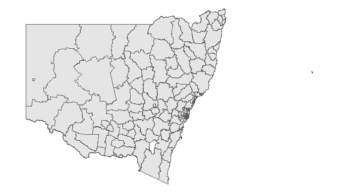

<!-- README.md is generated from README.Rmd. Please edit that file -->

# boundariesNSW

<!-- badges: start -->
<!-- badges: end -->

The goal of boundariesNSW is to simplify the acquisition and use of NSW
boundary shapefiles. The package has simply obtained various shapefiles,
coverted to geojson, and created helper functions to import them into
your R environment, or export them to a chosen directory.

source <https://dbr.abs.gov.au/absmaps/index.html>

Current shape files:

-   Local Government Area 2016; lga2016-geojson.gzip  
-   Local Government Area 2019; lga2019-geojson.gzip  
-   Local Health District 2010; lhd2010-geojson.gzip  
-   Postal Areas 2016; poa2016-geojson.gzip
-   Greater Capital City Statistical Area 2016; gccsa2016-geojson.gzip

These generally have boundary codes and names to join with other data.

## Installation

``` r
# install.packages("devtools")
devtools::install_github("Shaunson26/MoHReportR")
```

``` r
library(boundariesNSW)
```

## Usage

### list_maps()

The geojson are stored in the `extdata/` folder of the package
installation directory. We can list them with the function
`list_maps()`. This function is just a wrapper for `list.files()` and we
can use the `full.names` to list the full file path if required (not
shown). However, the next function `get_map` will handle extraction and
importing.

``` r
list_maps()
#> [1] "gccsa2016-geojson.gzip" "lga2016-geojson.gzip"   "lga2019-geojson.gzip"  
#> [4] "lhd2010-geojson.gzip"   "poa2016-geojson.gzip"
```

### get_map()

`get_map()` imports a chosen boundary into your R environment as an `sf`
object.

``` r
# Import LGA2019 into R
# * return_sf_object = TRUE is default
lga2019 <- get_map(boundary = 'lga2019', return_sf_object = TRUE)
#> lga2019-geojson.gzip extracted to C:\Users\60141508\AppData\Local\Temp\RtmpyiuVEY
#> Reading layer `lga2019' from data source 
#>   `C:\Users\60141508\AppData\Local\Temp\RtmpyiuVEY\lga2019_boundaries.geojson' 
#>   using driver `GeoJSON'
#> Simple feature collection with 129 features and 2 fields
#> Geometry type: MULTIPOLYGON
#> Dimension:     XY
#> Bounding box:  xmin: 141 ymin: -37.51 xmax: 159.11 ymax: -28.16
#> Geodetic CRS:  GDA94
```

`get_map()` has the option of just exporting the map to a chosen
directory

``` r
get_map(boundary = 'lga2019', geojson_extract_location = 'C:/Users/60141508', return_sf_object = FALSE)
#> lga2019-geojson.gzip extracted to C:/Users/60141508
```

### simplify_map

The default maps are often of too high resolution for regular tasks and
take time to plot. We can simply the maps using `simplify_map`

``` r
library(ggplot2)

ggplot(lga2019) +
  geom_sf() +
  theme_void()
```



``` r
lga2019_min <- simplify_map(lga2019, keep_proportion = 0.25)

ggplot(lga2019_min) +
  geom_sf() +
  theme_void()
```


## TODO

-   Add other boundaries  
-   Add tests
